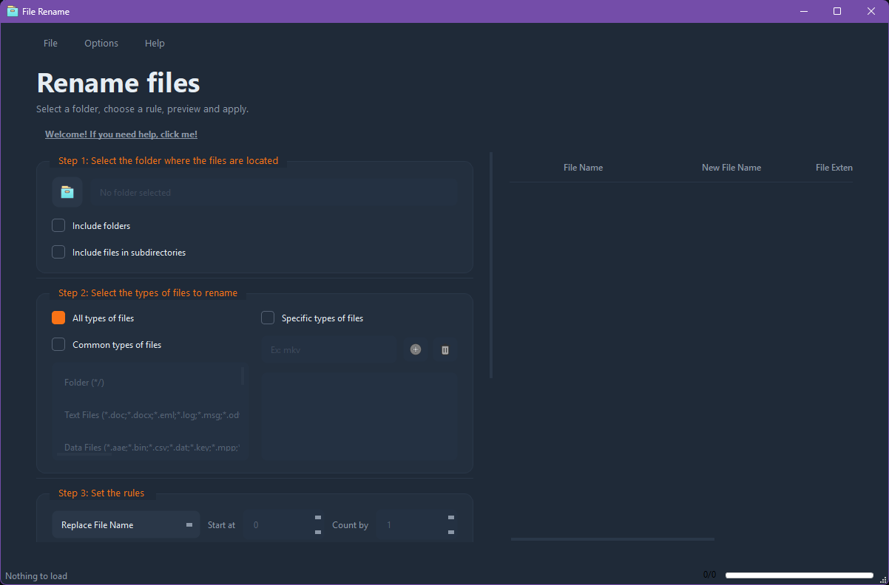

# File Rename

(resume)

[Getting Started](https://github.com/victobriel/File-Rename#Getting-Started) • [Features](https://github.com/victobriel/File-Rename#Features) • [Translate](https://github.com/victobriel/File-Rename#Translate) • [Contribution](https://github.com/victobriel/File-Rename#Contribution) [Screenshots](https://github.com/victobriel/File-Rename#Screenshots)

(what File Rename do)

### Highlights
* Renames multiple files, including folders
* 

## Getting Started

### Installation

#### Windows:

#### Linux, others:

not tested

### Usage

### Features

### Translate

### Languages

### Contribution

#### How can I contribute?

### Screenshots

