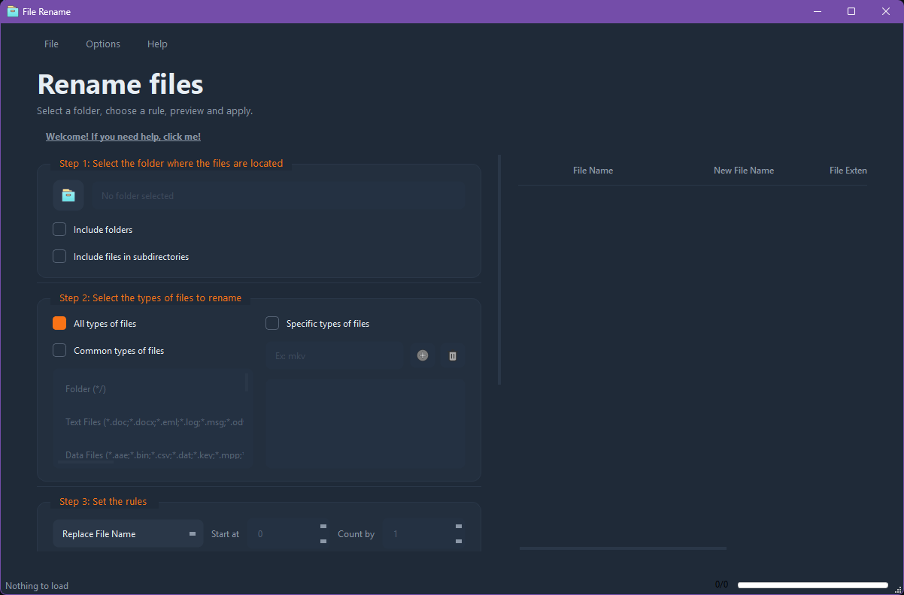

# File Rename

A Windows desktop application for batch renaming files and folders. Built with Python and PySide6, File Rename offers pattern-based renaming, regex, date/time tokens, and a live preview — with ZIP backups and path protection to keep your data safe.


- [Screenshots](#screenshots)
- [Features](#features)
- [Installation](#installation)
- [Usage](#usage)
- [Configuration](#configuration)
- [Project Structure](#project-structure)
- [Development](#development)
- [Troubleshooting](#troubleshooting)

## Screenshots

<p align="center">
  
</p>

## Features

### Core capabilities

- **Batch rename** files and folders in one pass.
- **Rename modes**:
  - **Add** — prefix or suffix text to names.
  - **Find and replace** — substitute text (plain or regex).
  - **Change extension** — bulk-set a new extension.
  - **Add number** — sequential numbering with a configurable start value and step.
- **Regex support** with a case-sensitivity toggle.
- **File-type filtering**:
  - All files.
  - Common categories (30+ built-in groups: documents, images, video, audio, archives, code, and more).
  - Custom extension list.
- **Folder support** — optionally include folder names in the rename pass.
- **Subdirectory scan** — recurse into nested directories when needed.
- **Real-time preview** — color-coded table showing original vs. new names before you commit.
- **Internationalization** — English (`en_US`) and Portuguese–Brazil (`pt_BR`).

### Safety features

- **ZIP backup** of the target directory before renaming (optional, recommended).
- **Protected paths** — refuses to operate on system locations such as `C:\Windows`, `Program Files`, `ProgramData`, `AppData`, and `System Volume Information`.
- **Hidden file and folder skipping**.
- **Visual preview** with row highlighting for files that will change.

### Date and time tokens

Insert the current date or time into any rename pattern:

| Token  | Meaning |
| ------ | ------- |
| `{%D}` | Day     |
| `{%M}` | Month   |
| `{%Y}` | Year    |
| `{%H}` | Hour    |
| `{%I}` | Minute  |

## Installation

### Prerequisites

- **Python 3.14+** (per `pyproject.toml`)
- **Windows** (the app targets Windows paths and protected directories)
- **[uv](https://docs.astral.sh/uv/)** is recommended for dependency management

### Install with uv (recommended)

```bash
git clone https://github.com/victobriel/File-Rename.git
cd File-Rename
uv sync
uv run python main.py
```

`uv sync` installs the exact versions pinned in `uv.lock`. `uv run` executes the app inside the managed virtual environment.

### Install with pip and venv

If you prefer pip, create a virtual environment and install the runtime dependencies manually:

```bash
git clone https://github.com/victobriel/File-Rename.git
cd File-Rename

python -m venv .venv
.venv\Scripts\activate

pip install "pyside6>=6.11.0" "pandas>=3.0.2"
python main.py
```

There is no `requirements.txt` — the dependency list lives in `pyproject.toml`.

## Usage

### Basic workflow

1. **Open a folder** — click the folder icon or use `File > Open Folder` and pick the target directory.
2. **Configure options** — toggle subdirectory scan, include folders, and enable backup (recommended).
3. **Select file types**:
   - **All files** — every entry is eligible.
   - **Common files** — pick from predefined categories.
   - **Specific files** — type custom extensions and press `Enter` to add each one.
4. **Choose a rename rule** — Add, Replace, Change Extension, or Add Number.
5. **Preview changes** — review the *New Name* column. Rows that will change are highlighted.
6. **Apply** — click **Rename** and confirm.

### Rename examples

**Add prefix**

```
Original: photo.jpg
Rule:     Add "vacation_" (prefix)
Result:   vacation_photo.jpg
```

**Sequential numbering**

```
Original: document.pdf, report.pdf, memo.pdf
Rule:     Add Number, start 1, step 1, format "({n})"
Result:   (1)document.pdf, (2)report.pdf, (3)memo.pdf
```

**Insert the current date via tokens**

```
Original: report.docx
Rule:     Replace "report" with "Report_{%Y}-{%M}-{%D}"
Result:   Report_2026-04-20.docx
```

**Timestamped log names using minute/hour tokens**

```
Original: log.txt
Rule:     Add "{%Y}{%M}{%D}_{%H}{%I}_" (prefix)
Result:   20260420_1435_log.txt
```

Remember: `{%I}` is **minute**, not an index. `{%H}` is hour in 24-hour form.

**Change extension**

```
Original: file.txt
Rule:     Change extension to "md"
Result:   file.md
```

**Regex replace**

```
Original: IMG_20240101_001.jpg
Rule:     Replace "IMG_(\d{8})_(\d{3})" with "Photo_$1"
Result:   Photo_20240101.jpg
```

### Keyboard shortcuts

- `Enter` — adds the typed extension in the *Specific Files* field.

## Configuration

Settings are stored in `config.ini`:

```ini
[config]
backup = False              ; Create a ZIP backup before renaming
language = en_US            ; UI language: en_US or pt_BR
encoding = utf-8            ; File encoding

[paths]
protect_paths = True        ; Refuse to operate on protected directories
protected = C:/Windows,C:/Program Files,C:/ProgramData,AppData,System Volume Information
```

### Supported file categories

The *Common files* filter includes 30+ categories, such as:

- **Documents** — Word, PDF, text, spreadsheets, presentations
- **Images** — JPG, PNG, GIF, BMP, SVG, WebP
- **Video** — MP4, AVI, MKV, MOV, WebM
- **Audio** — MP3, WAV, FLAC, OGG, AAC
- **Archives** — ZIP, RAR, 7Z, TAR, GZ
- **Code** — Python, JavaScript, Java, C/C++, and more

## Safety and best practices

> **Important:** batch renames are destructive in the sense that the original names are gone once applied. Review every run.

- Test on a small batch first.
- Keep **Protect Paths** enabled.
- Enable **Backup** for anything that matters.
- Inspect the preview carefully before clicking **Rename**.
- Never point the app at system folders.

## Project Structure

```
file-rename/
├── main.py                       # Entry point: launches MainWindow
├── pyproject.toml                # Project metadata and dependencies
├── uv.lock                       # Locked dependency graph (uv)
├── config.ini                    # User configuration
├── screenshots/
└── package/
    ├── configs/                  # Config file loading
    ├── domain/                   # Pure logic: rules, filters, tokens, entries
    │   ├── rename_rules.py       # Add / Replace / Change Extension / Add Number
    │   ├── filters.py            # File-type and visibility filters
    │   ├── file_entry.py         # Typed file record used across the app
    │   └── tokens.py             # Date/time token substitution
    ├── services/                 # Side-effectful operations
    │   ├── backup_service.py     # ZIP backup creation
    │   ├── file_scanner.py       # Directory traversal
    │   ├── rename_service.py     # Applies planned renames
    │   └── common_files_repository.py
    ├── views/                    # Qt windows, controllers, presenters
    │   ├── main_window.py        # Top-level window wiring
    │   ├── file_table_presenter.py
    │   ├── progress_status.py
    │   ├── message_boxes.py
    │   ├── ui_translator.py      # i18n glue
    │   └── controllers/
    ├── ui/
    │   └── ui_main.py            # Generated Qt Designer layout
    └── lang/                     # Language resources
```

## Development

### Run from source

```bash
uv sync
uv run python main.py
```

### Where to make changes

- **Add a new rename rule**: implement it in `package/domain/rename_rules.py`, then wire it into the controller used by `package/views/main_window.py`.
- **Change file-scanning or filtering behavior**: `package/domain/filters.py` and `package/services/file_scanner.py`.
- **Adjust backup logic**: `package/services/backup_service.py`.
- **Modify the window layout**: the Qt Designer-generated layout lives in `package/ui/ui_main.py`. Regenerate it from your `.ui` file rather than hand-editing if you use Qt Designer.
- **Add or update translations**: `package/lang/` and the glue code in `package/views/ui_translator.py`.

### Contributing

Pull requests and issues are welcome. Please keep changes focused and include a brief description of the problem and approach.

## Troubleshooting

**Error 0x0001 — Unable to access directory**
- Check folder permissions.
- Temporarily disable antivirus software.

**Error 0x0002 — Unable to load files**
- Files may be open in another program.
- Verify read permissions.

**Error 0x0003 — Unable to rename file**
- The file may be in use by another program.
- Check write permissions.
- The new name may contain invalid characters.

## Version history

**v1.0.0**
- Initial release
- Batch file and folder renaming
- Add, Replace, Change Extension, Add Number modes
- Regex support and date/time tokens
- ZIP backup and protected paths
- English and Portuguese (Brazil) translations

## License

Licensed under the terms specified in the [LICENSE](LICENSE) file.

## Author

**victobriel** — [@victobriel](https://github.com/victobriel)

## Acknowledgments

- Built with [PySide6](https://doc.qt.io/qtforpython/) (Qt for Python).
- Dependency management powered by [uv](https://docs.astral.sh/uv/).
- Common file-type categories curated from public file-extension references.
